# Continuous Delivery of Plotly Flask Application on GCP 

1. Create Project on GCP
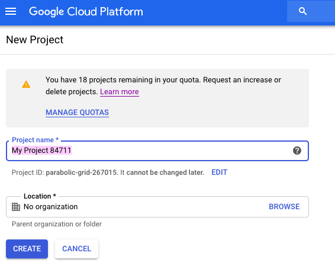

2. Activate Cloud Shell 
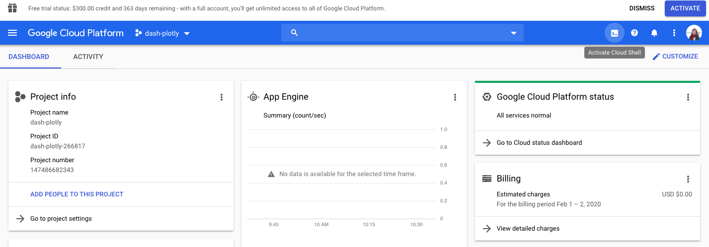

3. Activate project using the following command:
```gcloud config set project [PROJECT_ID]```

4. For the specific project, enable APIs for App Engine Admin and Cloud Build (which we'll need for later)
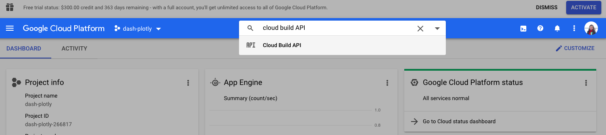
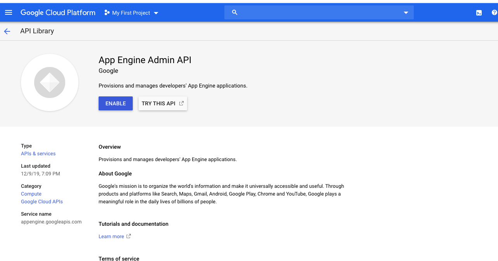

5. Create GitHub Repository and initialize a README.md and .gitignore for Python
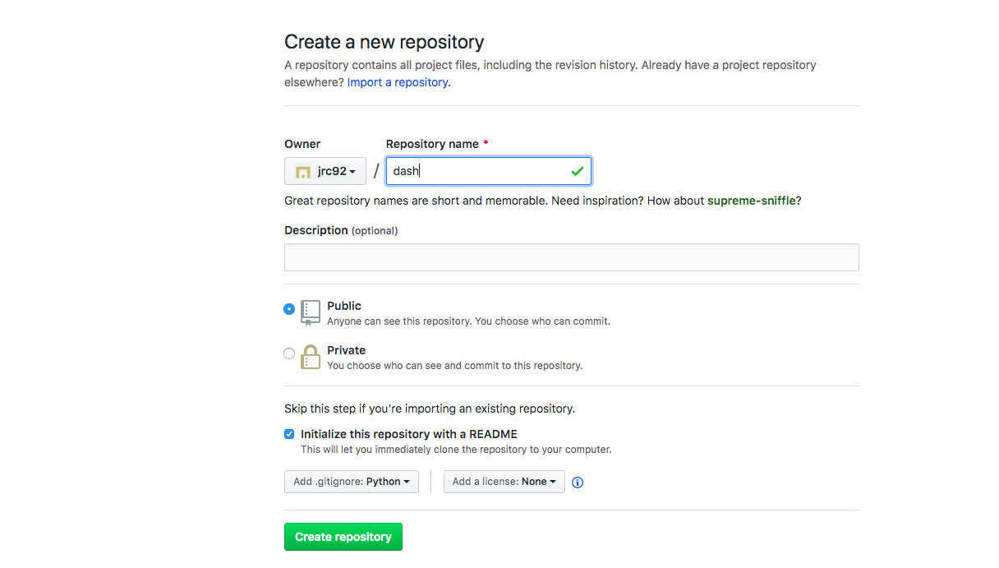

6. Next create a SSH key pair by typing ```ssh-keygen -t rsa``` in Cloud Shell and press 'Enter' key thrice

7. Access your SSH key via ```cat ~/.ssh/id_rsa.pub``` in Cloud Shell. 

8. On GitHub, click on the Profile icon on the top right, and choose Settings >> SSH and GPG keys. Click on 'New SSH Key', copy and paste the ssh-key from shell
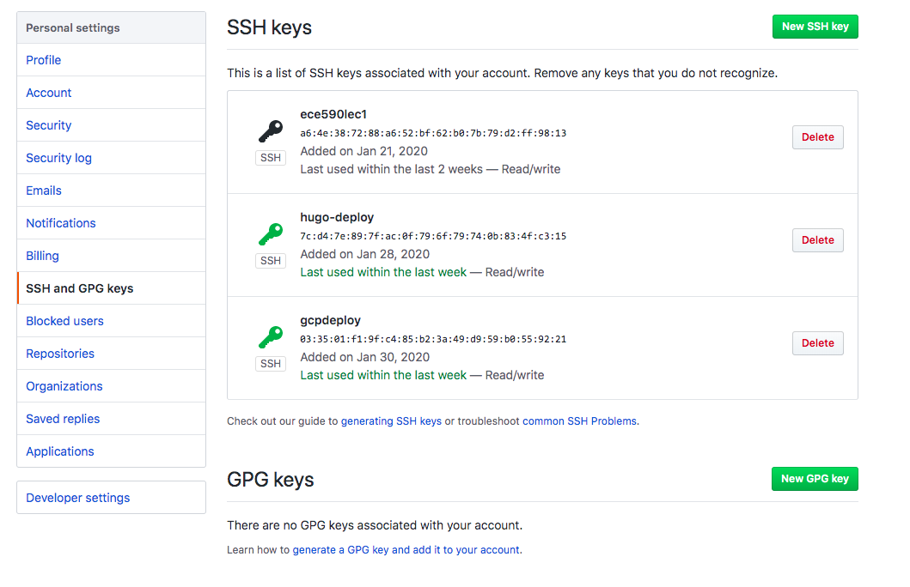

9. ```git clone``` the repository with SSH

10. In shell, ```cd [REPOSITORY NAME]``` and create the following files under the folder using ```touch app.yaml```, ```touch requirements.txt```, ```touch main.py``` and ```touch Makefile```
The contents of the files are as per the repository.
* ```app.yaml``` outlines configurations required for the app that we are building, such as runtime
* ```requirements.txt``` contains packages that the app requires to be installed
* ```Makefile``` contains compilation directives
* ```main.py``` will contain the codes for our Flask app

11. Create app engine app: ```gcloud app create```, and choose your location

11. Create a virtual machine by ```virtualenv --python $(which python) venv``` ```source venv/bin/activate```

12. On ```venv```, run ```make install``` on shell, which will automatically install all packages required by ```main.py```

13. Run our app on local machine using ```python main.py```. Access Dash via the local address provided
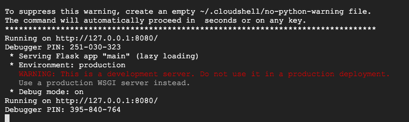

14. Now let's deploy the app on GCP: ```gcloud app deploy```, and access the app on https://[PROJECT_ID].appspot.com
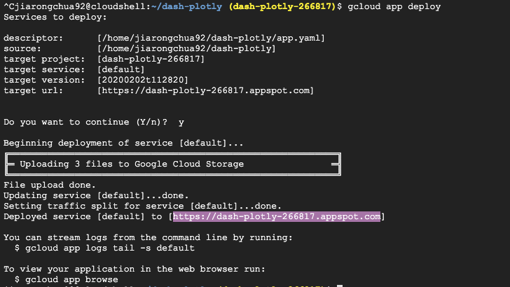

15. Moving onto Cloud Build: First, we create a ```cloudbuild.yaml``` file containing the following:
```
steps:
- name: "gcr.io/cloud-builders/gcloud"
  args: ["app", "deploy"]
timeout: "1600s"
```

16. Since we had enabled the API earlier, we can access the Cloud Build Dashboard for our project via the Navigational Pane in the top left
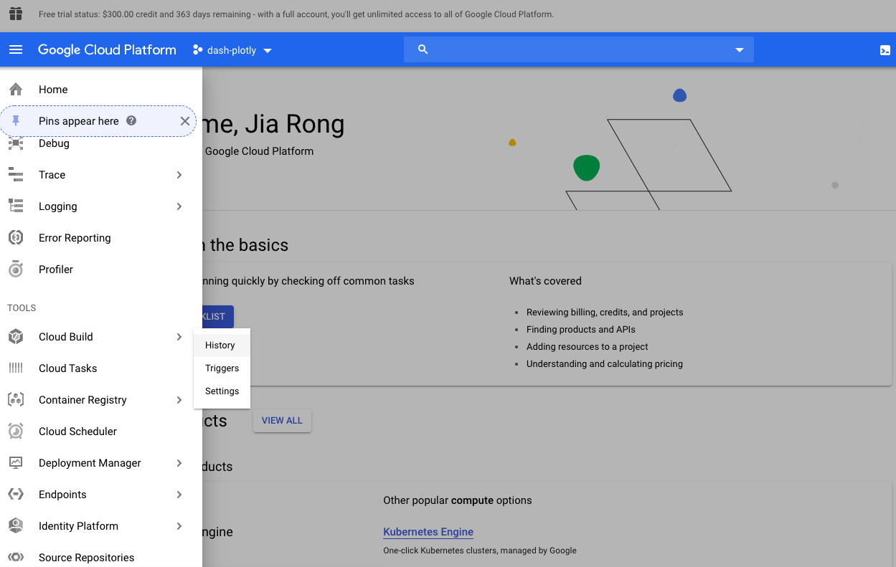

16. Lets create a build trigger based on ```git push``` into our GitHub repository. Choose GitHub as source, and connect to the specific project repo. 
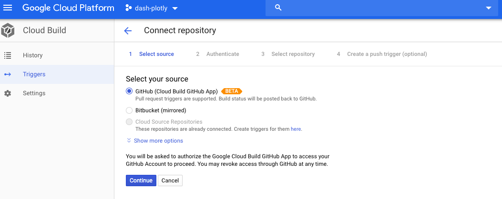

17. In the Specifications, we will specify 'Branch' trigger type and Build Configuration as 'Cloud Build configuration file (yaml or json)'
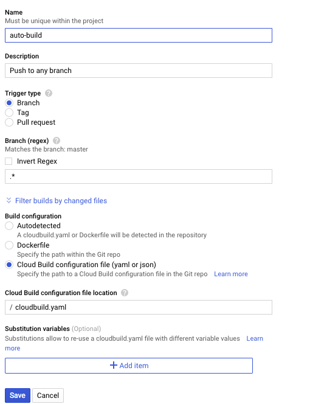

18. Next, we will trigger build by doing ```git add .```, ```git commit -m 'message'``` and ```git push```. Returning to the Cloud Build Dashboard, we will see the following in the 'History' tab
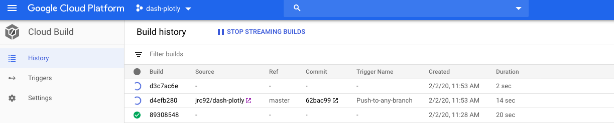
Clicking into the specific build ID shows the following:
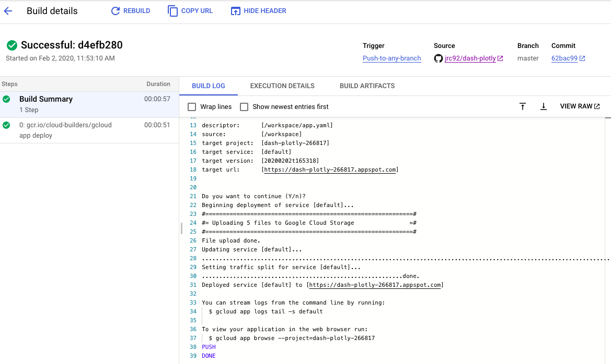
We can similarly access the page via the target url provided.


